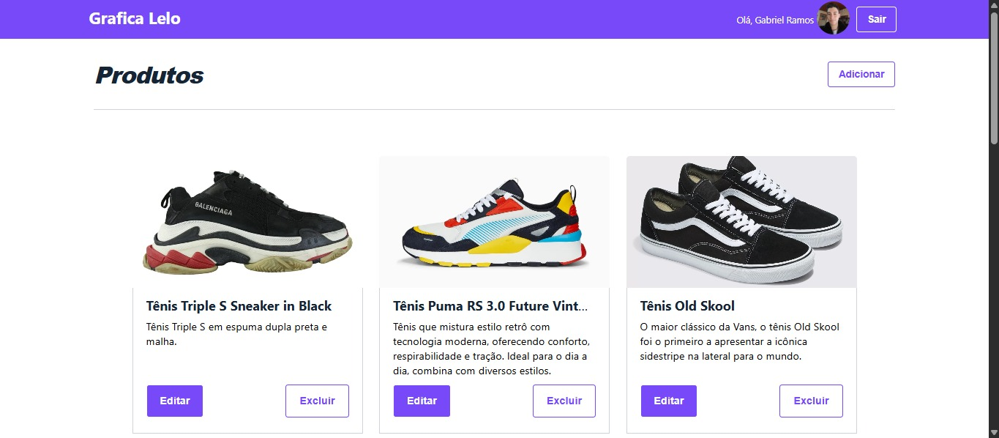
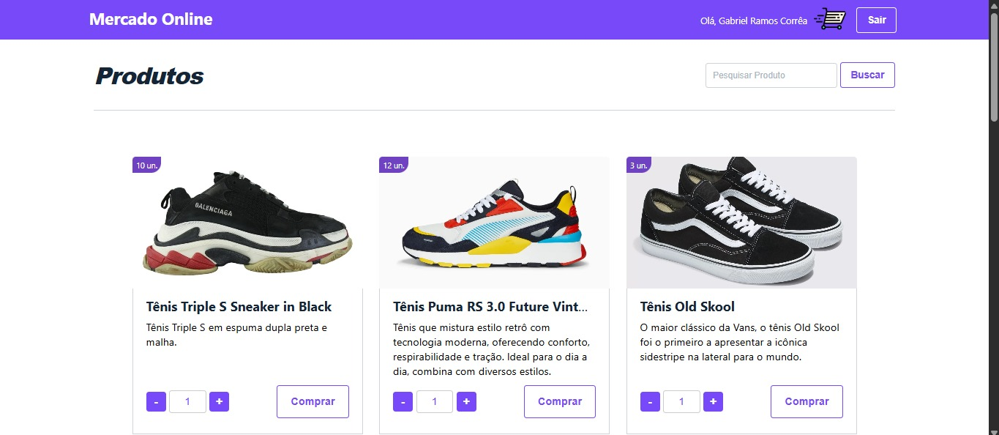
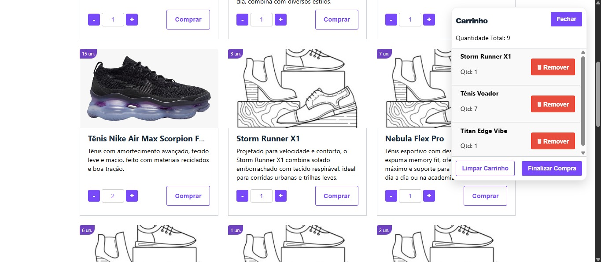

# Mercado Online — Sistema de Vendas

Um sistema completo de vendas online que integra funcionalidades essenciais como controle de estoque, gerenciamento de carrinho, autenticação via token JWT e envio automático de e-mails. Idealizado para fins acadêmicos, mas com estrutura sólida e escalável.

---

## Demonstrações Visuais

### Tela de Login

> Acesso seguro com validação de email e senha. Autenticação protegida por token JWT.

---

### Criação de Conta Cliente

> Cadastro com validação de e-mail via código, garantindo segurança e identificação do usuário.

---

### Painel Administrativo

> Visualização dos produtos cadastrados, com opções de edição, exclusão e monitoramento de estoque. Print com zoom de 90%.

---

### Página Principal do Cliente

> Catálogo interativo onde os clientes podem visualizar produtos, ajustar quantidades e adicionar ao carrinho. Print com zoom de 90%.

---

### Carrinho de Compras do Cliente

> Carrinho dinâmico com controle de quantidades, verificação de estoque em tempo real e feedbacks visuais.

---

### Tecnologias Utilizadas

#### Backend (Node.js + Express)
- **Express:** Criação de rotas RESTful e estrutura do servidor
- **MySQL2 (com Promise):** Conexão assíncrona com o banco de dados
- **JWT (jsonwebtoken):** Autenticação segura via token
- **dotenv:** Gerenciamento de variáveis de ambiente (ex: segredos e configs)
- **bcrypt:** Criptografia de senhas
- **Nodemailer:** Envio de e-mails de confirmação de compra
- **uuid:** Geração de IDs únicos para registros e tokens
- **fs (File System):** Manipulação de arquivos no servidor

#### Frontend (HTML + JS puro)
- Interface com manipulação dinâmica de DOM
- Comunicação com backend via `fetch` e JSON
- Armazenamento de token em cookie para autenticação contínua

---

## 🔒 Funcionalidades

- Autenticação de clientes com token seguro
- Validação de e-mail no cadastro
- Visualização de produtos disponíveis (somente os com estoque)
- Carrinho persistente e atualizado em tempo real
- Remoção automática de produtos esgotados
- Finalização de compra com envio automático de e-mail
- Painel administrativo para controle completo de produtos
- Aviso automático após 6 horas de carrinho inativo com produtos
- Interface fluída

---

## 💡 Como Executar Localmente
1. Clone o repositório:
   ```bash
   git clone https: https://github.com/Gabriel0Ramos0/Sistema-MercadoOnline.git
2. Instale as dependências do backend:
   ```bash 
   cd backend
   npm install
3. Configure as variáveis de ambiente (`.env`) e o banco de dados MySQL.

4. Inicie o servidor:
   ```bash
   node index.js
5. Abra `frontend/login.html` no navegador para acessar a interface.

---

## 💡 Autores
- **Gabriel Ramos Corrêa**  
  Desenvolvimento Full Stack, estrutura geral do sistema, integração de funcionalidades e interface com o usuário.  
  **Contato:** [GitHub](https://github.com/Gabriel0Ramos0) & [Linkedin](https://www.linkedin.com/in/gabriel-ramos-18531a259/)

- **Lucas Leandro Lima**  
  Responsável pelo Back-End, manipulação dos dados, integração com o banco de dados MySQL e instalação/configuração dos pacotes essenciais do Node.js.  
  **Contato:** [GitHub](https://github.com/Lucas0Lima21) & [Linkedin](https://www.linkedin.com/in/lucas-lima-l2023l/?originalSubdomain=br).

- **Luiz Fernando Mendes Alberton**  
  Responsável pela funcionalidade de envio de e-mails utilizando `nodemailer`, criação do perfil do administrador, apoio técnico no desenvolvimento do Back-End, contribuição na lógica das funcionalidades, suporte na instalação de bibliotecas e testes do sistema.  
  **Contato:** [GitHub](https://github.com/luizfernandomendesalberton) & [Linkedin](https://www.linkedin.com/in/luiz-fernando-mendes-alberton-4b1063178/).

---

- **Prof. Welquer Kestering Esser**  
   Orientador e Mentor do Projeto. Responsável pela condução da disciplina, direcionamento técnico, pedagógico e avaliação dos alunos.  
   **Contato:** [GitHub](https://github.com/Welquer)